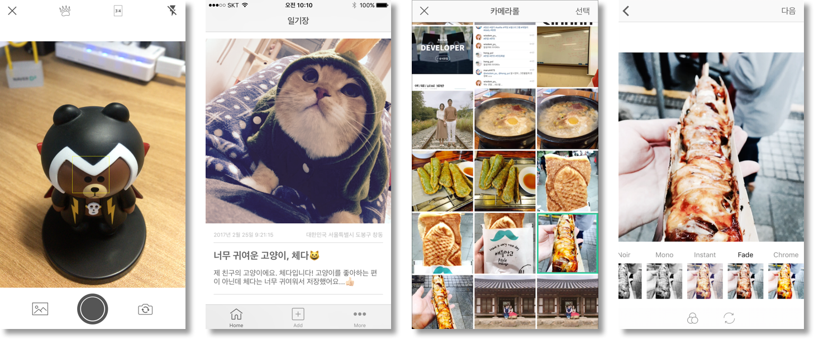
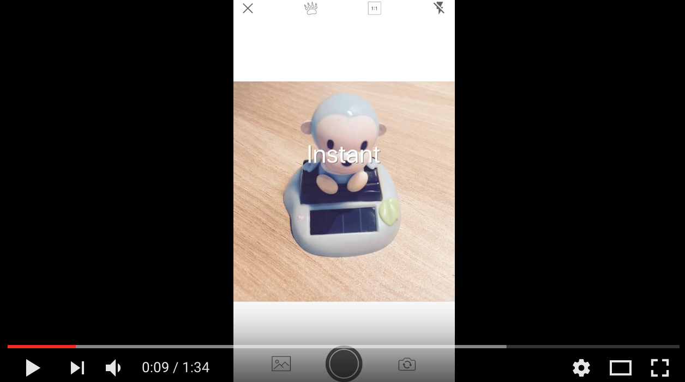
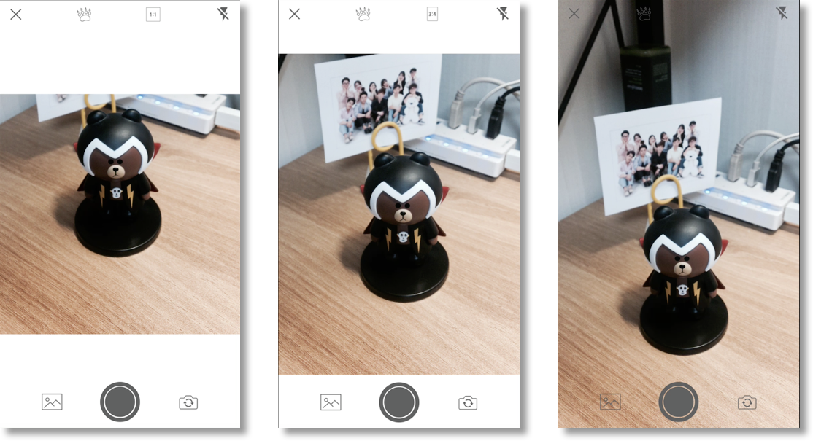
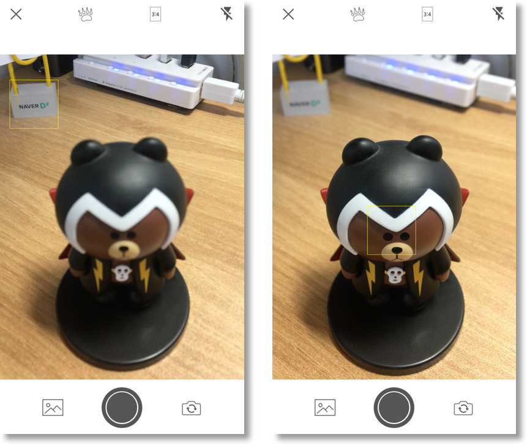
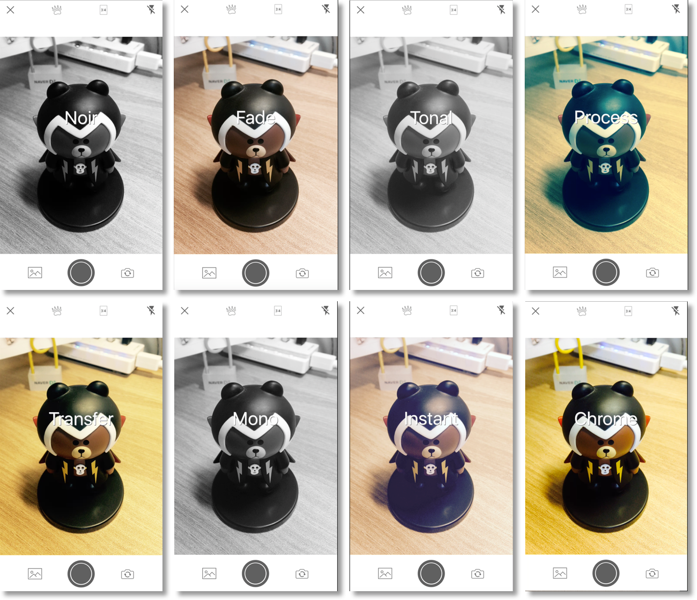
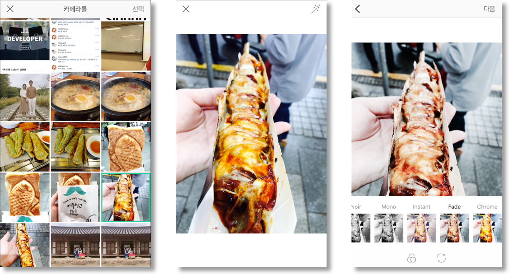
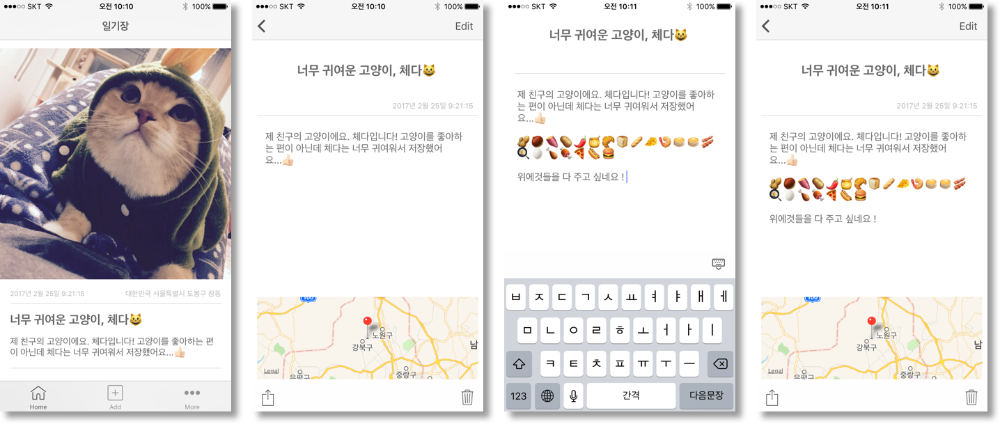

# DailyFilm

> 부스트캠프 iOS App Development Course에서 진행한 개인 프롤젝트이며,  2017.02.04 ~ 2017.02.25 걸쳐 개발한 프로젝트입니다. 빠르고, 강력하고, 안전한 언어인 Swift3와 AVFoundation, Core Image, Photos, UIKit Framework를 활용해서 커스텀 카메라 애플리케이션을 개발했습니다.


* 개선할 점
 1. 코드의 모듈화 및 최적화가 필요합니다. 
 2. Apple의 ```Core Image Filter Reference```를 참고하여 커스텀 필터 추가
 3. CIImage, 즉 CoreImage와 UIKit의 좌표가 다르기 때문에 얼굴인식에 대한 코드 개선이 필요합니다. 현재는 CIFeature의 CIFeatureTypeFace 중 Mouth만을 사용하고 있습니다. 정확도를 개선하겠습니다.
 4. 이미지 회전에 대한 이슈가 있습니다. ```CGAffineTransform```에 대한 분석이 필요합니다.
 5. White Balance 모드가 필요합니다.  ```var whiteBalanceMode: AVCaptureWhiteBalanceMode```
 6. ISO를 수동으로 조절하여 밝은 곳, 어두운 곳에서도 촬영이 매끄럽게 개선할 예정입니다. ```var exposureMode: AVCaptureExposureMode```
 7. 촬영 시간 ```UIDatePicker``` , 촬영 위치를 ```MKLocalSearchRequest``` 활용해서 기능을 개선할 예정입니다.

### 개요
* DailyFilm은 카메라로 필터 효과 및 보정을 통해 사진을 촬영하고 사진에 글을 남길 수 있는 카메라 일기장 애플리케이션입니다.
* 1:1, 3:4, 9:16 비율로 촬영 가능합니다.
* Focus(초점), Flash(라이트) 모드를 지원합니다.
* CIFilter, CIContext로 이미지 렌더링, 카메라에 필터를 적용하여 촬영가능합니다.
* PhotosKit으로 단말기의 사진을 불러와 기록할 수 있습니다.
* NAVER Speech Recognition API를 활용, 음성으로 글을 작성할 수 있습니다.
* 얼굴 인식 기능을 포함하고 있으며, 전면카메라에서 곰모양의 아이콘을 누르면 라인캐릭터가 나타납니다.(추후 개선 예정)
* 소개 페이지 - https://nso502354.github.io/DailyFilm/




### 시연영상
* 동영상
 [](https://youtu.be/LrZKTNDGAnY "Video")


### 세부 기능 소개

##### 촬영 스크린 비율 (1:1, 3:4, 9:16)



##### 초점(Foucs) 모드 (1:1, 3:4, 9:16)


##### 필터 적용하여 촬영하기


##### 포토 앨범에서 사진 가져오기


##### 포토 다이어리


### 사용기술

1.	AVFoundation Framework :  AVCaptureSession, AVCapturePhotoOutput, AVCaptureVideo
DataOutput을 활용하여 커스텀 카메라 뷰 개발
2.	Core Image Framework : CIFilter, CIContext(OPENGL ES3 api)를 활용하여 image rendering을 하였으며 카메라 필터 기능을 구현, CIDector를 통한 얼굴 검출
3.	Photos Framework : PHAsset, PHFetchResult을 활용하여 커스텀 사진 앨범 뷰 구현
4.	UIKit Framework : UICollectionView, UITableView, TabBarController, UIToolbar, PhotoKit
5.	NAVER Speech Rocognition : 음성인식으로 사진에 대한 글을 작성할 수 있는 기능 구현
6.	Database : SQLite와 FMDB Library를 활용하여 모바일 데이터베이스를 구축
7.	소스관리 : Git Branch 전략을 사용하여 소스코드 관리
8.	디자인 패턴 : MVC Pattern, Delegate Pattern, Singleton Pattern
9.	기타 활용 기술 : Swift3 언어의 Optional Chaning, Optional gurad else문, Custom Complition Closer, Extension를 하였습니다. GCD를 통한 비동기처리, Constants화 관리, UIAlertController를 통한 사진 및 카메라 접근 권한 유도, Constant화, .gitIgnore 관리


### 개발환경
* iOS 10.2.1, Xcode 8.2.1
* Swift3 (version 3.0.2)
